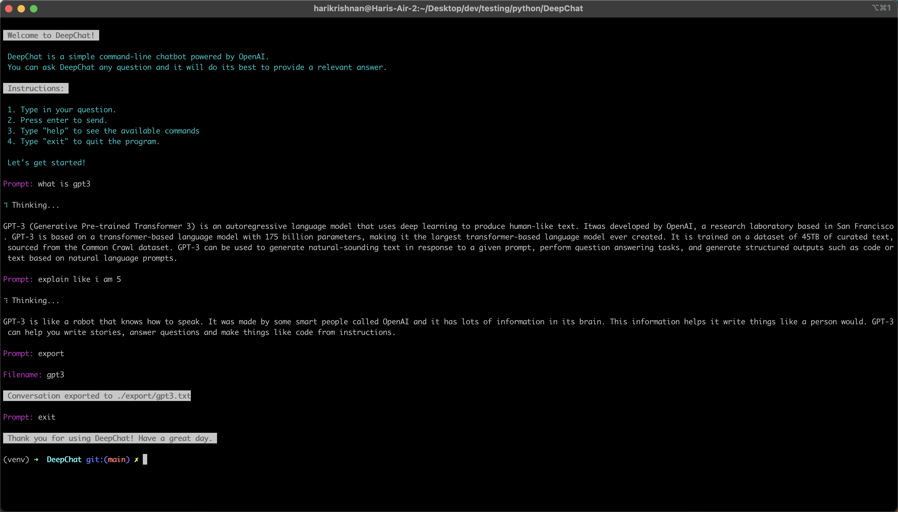

# DeepChat

DeepChat is a simple command-line chatbot powered by OpenAI, providing real-time Q&A with a user-friendly interface following Material Design guidelines.




## Getting Started
### Motivation
With ChatGPT, you have access to a powerful conversational AI, but the high traffic can be frustrating. That's why I have created a custom chatbot solution, based on OpenAI's GPT-3 API, to provide a more efficient and stable experience. To get started, all you have to do is generate an API key from the OpenAI website, store it in a .env file, and you can start building your own, custom conversations. From powerful, interactive dialogues to automated customer service, this solution enables you to create valuable and reliable AI-driven conversational experiences. What's more, you can also save, load and export chats with ease, giving you complete control over your conversations and data.

### Prerequisites

You'll need to generate an OpenAI API key and store it in your environment variables as `OPENAI_API_KEY`. You can do this by following the instructions on the OpenAI website.

You'll also need to create a virtual environment and install the required packages. You can do this by running the following commands:

```
python3 -m venv myenv
source myenv/bin/activate
pip install -r requirements.txt
```

### Running the chatbot

To run the chatbot, simply run the following command in your terminal: `python deepchat.py`

The chatbot should start up, and you can start interacting with it.

## License

This project is licensed under the [MIT License](LICENSE).

## Acknowledgments

- [OpenAI](https://openai.com) for providing the API and tools to make this project possible.


